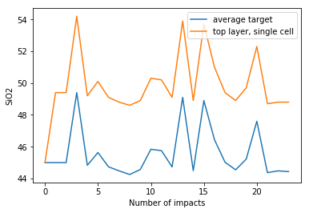

# Dynamic geospatial model of IMPaCS, using the size-frequency distribution of impacts scaled from the lunar surface, we generate the volume and abundance of this enriched crust on Earth’s surface during the Hadean to determine how rapidly it evolved.

#### Probability of impact through the 500 Million Year Hadean period.

#### Impacts at one grid on earth during the 500 Million Year Hadean period.

#### SiO2 through time at one test cell

