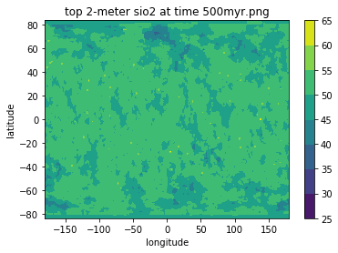

# Dynamic geospatial model of IMPaCS
This repository hosts the Dynamic Geospatial Model of IMPAaCS, a sophisticated simulation tool that leverages the size-frequency distribution of impacts, extrapolated from lunar surface data, to reconstruct the evolution of Earth's crust during the Hadean eon, spanning approximately 500 million years.

## Overview
The model generates detailed insights into the volume and abundance of enriched crust on Earth's surface, offering a unique perspective on the planet's early geological development. It employs advanced algorithms to simulate meteorite impacts and their subsequent effects on Earth's geology, particularly focusing on the distribution and evolution of Silicon Dioxide (SiO2) content.

### Key features
**Impact Probability Analysis**: The model calculates the likelihood of meteorite impacts throughout the Hadean period, providing a probabilistic understanding of these events.
**Grid-Based Impact Simulation**: It simulates impacts on a grid-based representation of Earth, offering a detailed view of the impact distribution over time.
**SiO2 Concentration Tracking**: A core aspect of the model is tracking the SiO2 concentration at various depths, reflecting the geochemical changes due to impacts.
**Visualization Tools**: The model includes functions for visualizing the distribution of SiO2 and the impact dynamics, aiding in the interpretation of simulation results.

### Visualizations
**Probability of Impact**: A graphical representation of impact probabilities over the Hadean period.
**Impact Dynamics**: Detailed views of impacts at specific grid locations, showing the temporal evolution of impact events.
**SiO2 Distribution**: Maps and charts illustrating the distribution and concentration of SiO2 at different depths and times.

### Model Components
#### impacts.py
**Distance Calculation**: Essential for determining the affected area by an impact, based on the geographical coordinates.
**Class IMPAaCS**: The central class of the model, initializing with various parameters like grid information, impact melt depth, and SiO2 content.
**Model Dynamics**: Includes methods like update for simulating impacts and state_dynamics for altering the chemical composition of grid cells.
**Visualization and Analysis**: Functions for categorizing and visualizing SiO2 content, and methods for analyzing the vertical distribution of SiO2.
#### run_full_impacts.py
**Grid Initialization**: Sets up a grid system for the simulation, ensuring correct dimensions.
**Impact Size and Frequency**: Defines meteorite size categories and calculates impact frequencies based on historical data.
**Simulation Loop**: Iteratively simulates impacts, updating the IMPAaCS model with each event.
**Data Analysis and Saving**: Analyzes and saves the state of the model at each simulation step, allowing for detailed examination of impact effects.

## Selected results

#### Probability of impact through the 500 Million Year Hadean period.

#### Impacts at one grid on earth during the 500 Million Year Hadean period.

#### SiO2 through time at one test cell

#### SiO2 distrtibution in the top 2m of Earth after 500myr of impacts

## Usage
### Running the Simulation
The simulation is primarily executed through a SLURM script named `run_impacts.slurm``. This script is designed to manage and orchestrate the simulation process on systems that support SLURM, a widely-used job scheduling system for Linux clusters.
#### Key Steps:
**SLURM Script**: The run_impacts.slurm script initiates the simulation process. It sets up the necessary computing environment and resources required for the simulation.

**Calling `run_full_impacts.py`**: The SLURM script then calls `run_full_impacts.py`, a Python script that serves as the main entry point for the simulation. This script handles the detailed aspects of the simulation, including initializing the grid, setting up impact sizes and frequencies, and running the impact simulation loop.
**Utilizing `impacts.py`**: The `run_full_impacts.py`` script leverages functionalities defined in impacts.py. This file contains the core logic for the IMPAaCS model, including the calculation of distances, the definition of the IMPAaCS class, and various methods for updating the model state, handling dynamics, and visualizing results.

### Important Note for Users
**SLURM Script Customization**: The run_impacts.slurm script may require modifications to align with your specific computing environment and resource availability. It includes settings for job partition, job name, node exclusions, and output file configurations. Please review and adjust these settings based on your system's requirements and SLURM configuration.
**Resource Requirements**: The simulation can be resource-intensive, depending on the scale and parameters chosen. Ensure that your system has adequate computational resources to handle the simulation's demands.

### Getting Started
#### To start a simulation:
 - Review and modify run_impacts.slurm as per your system's SLURM configuration.
 - Submit the SLURM script to your cluster's job scheduler using the command sbatch run_impacts.slurm.
 - Monitor the job's progress through the output and error files specified in the SLURM script.
For detailed information on the model parameters, simulation settings, and output interpretation, refer to the code within the `impacts.py` and `run_full_impacts.py` scripts.

## Python file content
#### impacts.py
**Distance Calculation**: The distance function calculates the distance between two points on Earth's surface given their latitudes and longitudes. This is crucial for determining the area affected by an impact.  
Class IMPAaCS: This is the main class for the model. It initializes with a variety of parameters like grid information (egrid), impact melt depth, SiO2 content, and discretization parameters.  
**Model Updates and Dynamics**:
 - The update method simulates the effect of an impact at a specific location and time.
 - The state_dynamics method is central to the model, altering the chemical composition of the grid cells based on the impact.  
**SiO2 Distribution and Visualization**:
 - Methods like re_bin_sio2 and plot_map_and_bar handle the categorization of SiO2 content and its visualization on a map.
 - The model focuses on the vertical distribution of SiO2, considering different layers of the Earth's crust.  
**Impact Crater Modeling**: The model considers the diameter of the impact crater and the angle of impact, which affects the depth of penetration and the area affected.  
**Sampling and Analysis**: The model can subset the grids for analysis (get_subset_of_grids) and calculate the volume of crustal material affected by impacts (calculate_relative_percent_crust_vol_multiplier).  
**Testing and Experimentation**: The model allows for testing specific grid cells to understand the impact dynamics in detail.

#### run_full_impacts.py
The script `run_full_impacts.py`` is designed to simulate the frequency and distribution of meteorite impacts on Earth over a specified time period, using the IMPAaCS class from the impacts module. Here's a breakdown of its key components and functionalities:  
**Grid Initialization**:  
 - Initializes an EASE2_grid object with a specified grid size.
 - Asserts that the grid shape matches the expected dimensions.  
**Impact Size and Frequency Setup**:
 - Defines size bins for meteorite diameters and corresponding labels.
 - Reads frequency data from a CSV file (sfd.csv) and calculates the frequency of impacts for different size bins.
**Simulation Parameters**:
 - Sets the total simulation time (t_total) and a scaling factor (freq_factor) for impact frequencies.
**Impact Frequency Calculation**:
 - Uses a Poisson distribution to simulate the number of impacts over time for each size bin.
 - Adjusts frequency factors based on whether the simulated total impacts fall within the expected range (high and low frequencies from sfd.csv).  
**Impact Simulation Loop**:
 - Iterates over time steps, simulating impacts at random locations on Earth.
 - Skips impacts at latitudes beyond ±45 degrees.
 - For each impact, it calculates the impact location and diameter, then updates the IMPAaCS model with these parameters.  
**Model Update and State Saving**:
 - The IMPAaCS model (I) is updated with each impact's location, diameter, and time.
 - The state of the model (chemical composition of the grid cells) is saved to a file after each time step.  
**Visualization and Analysis**:
 - The script has commented-out code for plotting the results (I.plot_map()).
 - Prints out various lists related to the test cell, such as time, average target, and top layer at the test cell.

## Citation Guide

For information on how to cite this project in your academic work, please refer to our [Citation Guide](./CITATION.md).

## References

- Faltys, J., Wielicki, M. M., & Frame, J. (2021). Earth’s Early Evolution: A felsic crustal composition during the Hadean. Oral presentation at Goldschmidt Conference, Room 15 (Online), July 7. Retrieved from [GoldSchmidt Conference](https://conf.goldschmidt.info/goldschmidt/2021/meetingapp.cgi/Paper/3439)
